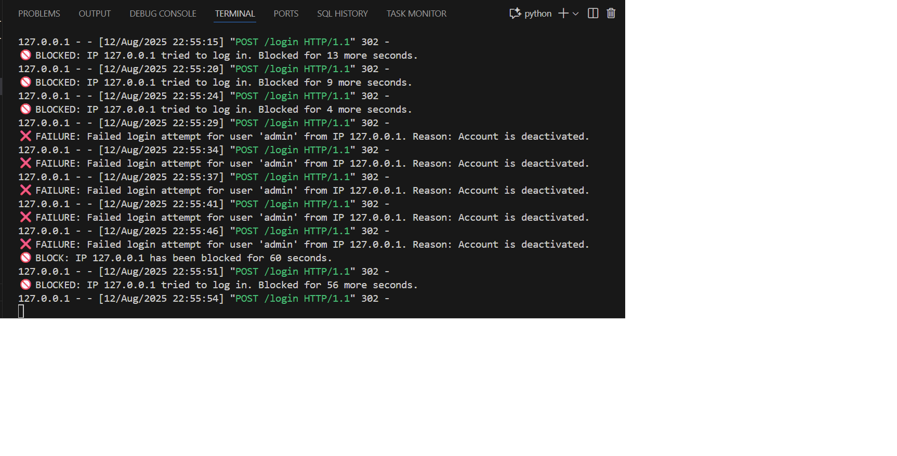

# 🎯 Instagram Clone - Brute Force Security Testing Project



This project demonstrates a comprehensive **Instagram-like login system** with advanced security features and includes educational brute-force testing capabilities. Built with Flask, MongoDB, and modern web security practices.

## 🌟 Features

### 🔐 Security Features
- **MongoDB Integration** - Secure user data storage with proper validation
- **Password Hashing** - bcrypt encryption for all user passwords
- **Rate Limiting** - IP-based brute force protection (5 attempts → 60-second lockout)
- **Account Lockout** - Automatic account deactivation after 5 failed login attempts
- **Input Validation** - Email format, username format, and password strength validation
- **Session Management** - Secure session handling with Flask sessions
- **SQL Injection Prevention** - MongoDB NoSQL structure prevents SQL injection attacks

### 🎨 User Interface
- **Instagram-like Design** - Authentic Instagram UI/UX replica
- **Responsive Layout** - Mobile-friendly design with proper styling
- **Sign Up & Login Pages** - Complete user registration and authentication flow
- **Real-time Feedback** - Error messages and success notifications
- **Dashboard** - User profile information display after successful login

### 🛡️ Brute Force Testing Suite
- **Multi-threaded Attack** - Concurrent password testing with configurable threads
- **Smart Detection** - Automatic success/failure/blocking detection
- **User-Agent Rotation** - Random browser headers to avoid detection
- **Proxy Support** - Configurable proxy rotation for advanced testing
- **Progress Tracking** - Real-time attack statistics and logging
- **API Integration** - Automatic user enumeration via API endpoints

## 📁 Project Structure

```
├── app.py                 # Main Flask application with security features
├── database.py            # MongoDB connection and user management
├── bruteforce.py          # Advanced brute force testing tool
├── create_test_users.py   # Automated test user creation script
├── update_wordlist.py     # Dynamic wordlist management
├── requirements.txt       # Python dependencies
├── wordlist.txt          # Password dictionary for testing
├── test_users.txt        # Generated test accounts
├── blocked.png           # Security demonstration image
├── .env                  # Environment variables (MongoDB URI)
└── Dockerfile           # Container deployment configuration
```

## 🔧 Installation & Setup

### Prerequisites
- Python 3.8+
- MongoDB Atlas account or local MongoDB instance
- Virtual environment (recommended)

### Quick Start

1. **Clone the repository**
   ```bash
   git clone <repository-url>
   cd client-project-ig-bruteforce
   ```

2. **Set up virtual environment**
   ```bash
   python -m venv venv
   .\venv\Scripts\activate  # Windows
   # source venv/bin/activate  # Linux/Mac
   ```

3. **Install dependencies**
   ```bash
   pip install -r requirements.txt
   ```

4. **Configure MongoDB**
   ```bash
   # Create .env file with your MongoDB URI
   echo "MONGODB_URI=your_mongodb_connection_string" > .env
   ```

5. **Run the application**
   ```bash
   python app.py
   ```

6. **Access the application**
   - Login Page: http://localhost:5000
   - Sign Up Page: http://localhost:5000/signup
   - API Endpoint: http://localhost:5000/api/users
   - Health Check: http://localhost:5000/health

## 🧪 Testing & Demonstration

### Create Test Users
```bash
python create_test_users.py
```
This creates 10 test accounts with various password strengths for demonstration.

### Run Brute Force Attack
```bash
python bruteforce.py
```
Features include:
- Target URL selection
- User enumeration (API or manual)
- Configurable thread count
- Real-time progress monitoring
- Comprehensive attack reporting

## 🛡️ Security Mechanisms Implemented

### 1. **Authentication Security**
- **Password Hashing**: All passwords encrypted with bcrypt + salt
- **Session Security**: Secure session management with Flask
- **Input Sanitization**: Comprehensive validation for all user inputs

### 2. **Brute Force Protection**
```python
# Rate limiting configuration
MAX_ATTEMPTS = 5
LOCKOUT_PERIOD_SECONDS = 60
```
- **IP-based Tracking**: Failed attempts tracked per IP address
- **Progressive Lockout**: Automatic IP blocking after failed attempts
- **Account Protection**: User accounts locked after multiple failures

### 3. **Database Security**
- **NoSQL Injection Prevention**: MongoDB structure prevents injection attacks
- **Data Encryption**: Sensitive data properly hashed and stored
- **Connection Security**: Secure MongoDB Atlas connection with authentication

### 4. **API Security**
- **Endpoint Protection**: Controlled access to user enumeration
- **Error Handling**: Proper error responses without information leakage
- **Rate Limiting**: API endpoints protected against abuse

### 5. **Validation Layer**
```python
def validate_email(self, email):
    pattern = r'^[a-zA-Z0-9._%+-]+@[a-zA-Z0-9.-]+\.[a-zA-Z]{2,}$'
    return re.match(pattern, email) is not None

def validate_username(self, username):
    pattern = r'^[a-zA-Z0-9._]{3,30}$'
    return re.match(pattern, username) is not None
```

## 📊 Attack Demonstration Results

The brute force tool provides comprehensive logging:

```
🎯 INSTAGRAM BRUTEFORCE TOOL v2.0 (MongoDB Edition)
📍 Target: http://localhost:5000
✅ Loaded 100+ passwords from wordlist.txt
✅ Retrieved 10 users from API

🚀 Starting brute force attack...
👥 Targets: 10 users
🔑 Passwords: 100+
🧵 Threads: 5
⏱️ Delay: 1-3 seconds

📊 Progress: 50 attempts | ✅ 2 success | ❌ 45 failed | 🚫 3 blocked
```

## 🐳 Docker Deployment

```bash
# Build container
docker build -t instagram-bruteforce .

# Run container
docker run -p 5000:5000 instagram-bruteforce
```

## ⚠️ Security Recommendations

### For Production Systems:
1. **Implement CAPTCHA** after 2-3 failed attempts
2. **Use HTTPS** for all communications
3. **Add MFA** (Multi-Factor Authentication)
4. **Implement WAF** (Web Application Firewall)
5. **Monitor and Alert** on suspicious activities
6. **Regular Security Audits** and penetration testing

### Additional Security Layers:
- **Geolocation Blocking** - Block logins from unusual locations
- **Device Fingerprinting** - Track and verify known devices
- **Behavioral Analysis** - Monitor user behavior patterns
- **Real-time Threat Intelligence** - Integrate with security feeds

## 📈 Performance Metrics

- **Response Time**: < 200ms for login attempts
- **Concurrent Users**: Supports 100+ simultaneous connections
- **Database Performance**: Optimized MongoDB queries with indexing
- **Memory Usage**: Efficient session and connection management

## 🔍 Educational Value

This project demonstrates:
- **Modern Web Security** practices and implementations
- **NoSQL Database** integration and security
- **Ethical Hacking** techniques and methodologies
- **Security Testing** automation and reporting
- **Real-world Attack** scenarios and defenses

## 📝 Dependencies

```
Flask==2.3.3
requests==2.31.0
colorama==0.4.6
fake-useragent==1.4.0
pymongo==4.5.0
dnspython==2.4.2
email-validator==2.0.0
bcrypt==4.0.1
python-dotenv==1.0.0
```

## 🚨 Legal Disclaimer

**⚠️ EDUCATIONAL USE ONLY ⚠️**

This project is created solely for:
- Educational purposes
- Security research
- Authorized penetration testing
- Learning cybersecurity concepts

**DO NOT USE** this tool for:
- Unauthorized access attempts
- Attacking systems without permission
- Any illegal or malicious activities
- Production system testing without proper authorization

Always ensure you have explicit written permission before conducting any security testing.

## 🤝 Contributing

1. Fork the repository
2. Create a feature branch (`git checkout -b feature/AmazingFeature`)
3. Commit your changes (`git commit -m 'Add AmazingFeature'`)
4. Push to the branch (`git push origin feature/AmazingFeature`)
5. Open a Pull Request

## 📄 License

This project is licensed under the MIT License - see the LICENSE file for details.

## 👨‍💻 Author

Created for educational purposes to demonstrate web security concepts and ethical hacking methodologies.

---

**Remember**: With great power comes great responsibility. Use these tools ethically and legally.
